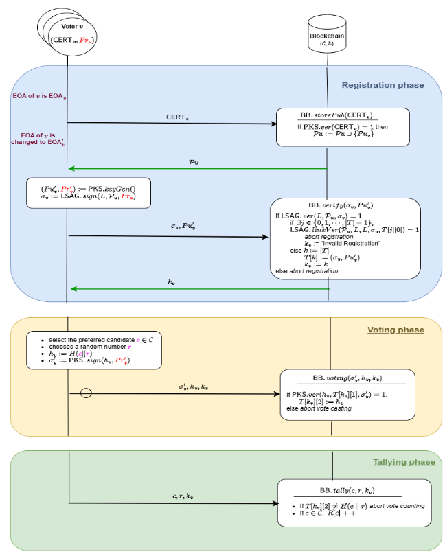

# LSAG-Based E-Voting System

> **Network**: Deployed on private IITBH blockchain (RPC: http://10.10.0.60:8550) — Gas fees are not an issue

**Contract Address**: `0xED8CAB8a931A4C0489ad3E3FB5BdEA84f74fD23E`

---

## System Overview



---

## Architecture & Components

### Core Design Principle
This protocol is designed to **eliminate the need for a central server**. The only two components in the system are:
1. **Voter's Local Machine** - where all vote generation and verification happens
2. **Blockchain Smart Contract** - immutable record keeping and verification

There is **nothing in between** - no intermediate server or authority storing votes.

### Interaction Modes

#### 🖥️ **Main Branch (CLI Interface)**
On the main branch, you'll find a **CLI-based interface** that allows users to interact with all election steps:
- System setup and contract deployment
- Voter registration with LSAG signatures
- Vote generation and casting
- Vote tallying and result verification

Simply follow the election flow steps below to run the election through the command line.

#### 🎨 **Frontend Testing Branch (GUI Interface)**
For a beautiful graphical user interface, switch to the `frontend-testing` branch:
```bash
git checkout frontend-testing
```

After switching, set up both frontend applications:

**Voter Portal:**
```bash
cd voter-portal
npm install
npm run dev
```

**Government Frontend:**
```bash
cd government-frontend
npm install
npm run dev
```

This allows you to host local elections and interact with them through an intuitive graphical interface.

> **Note**: Frontend development is still in progress. For the complete and stable experience, use the main branch CLI interface.

---

## Election Flow

### Phase 0: Deploy Smart Contracts

**Step 0a: Deploy Secp256k1 Library** (REQUIRED FIRST)
```bash
npx hardhat run scripts/deploy-secp256k1.js --network iitbh
```
**Output**: Secp256k1 contract address (needed by EVoting)

**Step 0b: Deploy EVoting Contract**
```bash
npx hardhat ignition deploy ignition/modules/Evoting.ts --network iitbh
```
**Output**: EVoting contract address (uses Secp256k1 library)

↓

### Phase 1: System Setup
```bash
node scripts/admin/simple-setup.js
```
- Creates config directory
- Generates government authority keys (ECDSA)
- Saves `deployment.json` and `government-config.json`

↓

### Phase 1.5: Voter Registration (LSAG-based)

**Step 1: Generate Key Pair**
```bash
node scripts/generate-keypair.js
```
**Output**: Private key + Public key (64 bytes) - save both ✅

**Step 2: Pre-Register with Government**
```bash
node scripts/pre_registration/pre-register-voter.js
```
**Input**: Voter name, public key (from Step 1), student ID  
**Output**: `CERT_<sid>.json` (government-signed certificate) ✅

**Step 3: Update Voter Ring**
```bash
node scripts/registration_new/update_voter_ring.js scripts/pre_registration/CERT_<sid>.json
```
**Output**: Voter added to ring, returns ring members + voter position ✅

**Step 4: Generate LSAG Signature**
```bash
ORIGINAL_PRIVATE_KEY=0x... REGISTERED_PUBLIC_KEY=0x... VOTER_NAME="..." VOTER_SID="..." \
npx hardhat run scripts/registration_new/generate-lsag-signature.js --network iitbh
```
**Output**: `LSAG_<sid>.json` (signature proving ring membership) ✅

**Step 5: Submit Registration (BBverify)**
```bash
LSAG_FILE=scripts/pre_registration/LSAG_<sid>.json \
npx hardhat run scripts/registration_new/submit-lsag-registration.js --network iitbh
```
**Output**: **Kv (Registration Index)** - voter is now registered & can vote ✅

↓

### Phase 2: Vote Casting (PKS Signature-Based)

**Step 1: Generate and Cast Vote**
```bash
NEW_PRIVATE_KEY=0x... CANDIDATE_CHOICE=A KV=<registration_index> node scripts/voting/generate-vote.js
```
**Input**: 
- `NEW_PRIVATE_KEY`: Voter's signing key
- `CANDIDATE_CHOICE`: Candidate (A, B, C, D, or E)
- `KV`: Registration index from Phase 1.5

**Local Machine** (Off-chain):
- Generates random value `r` (32 bytes)
- Computes vote hash: `h_v = keccak256(candidate || r)`
- Signs hash with voter's private key (PKS signature: r, s, v)
- Saves vote file to `scripts/config/vote_<timestamp>.json` ✅

**Blockchain** (On-chain):
- Calls `BBvoting(kv, h_v, r, s, v)` (~60k gas)
- Stores vote in registration table T[kv][2] = h_v

↓

### Phase 3: Vote Tallying (Verification & Counting)

**Step 1: Tally Votes**
```bash
VOTE_FILE=scripts/config/vote_<timestamp>.json node scripts/voting/tally-votes.js
```
**Input**: Path to vote file from Phase 2

**Local Machine** (Off-chain):
- Extracts: `kv` (voter index), `candidate`, `r` (random value)
- Verifies vote integrity: `keccak256(candidate || r)` locally ✅

**Blockchain** (On-chain):
- Calls `BBtally(kv, candidate, r)` (~49k gas) to verify & count vote
- Increments candidate vote count R[candidate]
- Retrieves final election results for all candidates (A-E)

**Output**: 
```
Election Results:
- Candidate A: X votes
- Candidate B: Y votes
- ...
- Total: N votes
```
✅ Results displayed


