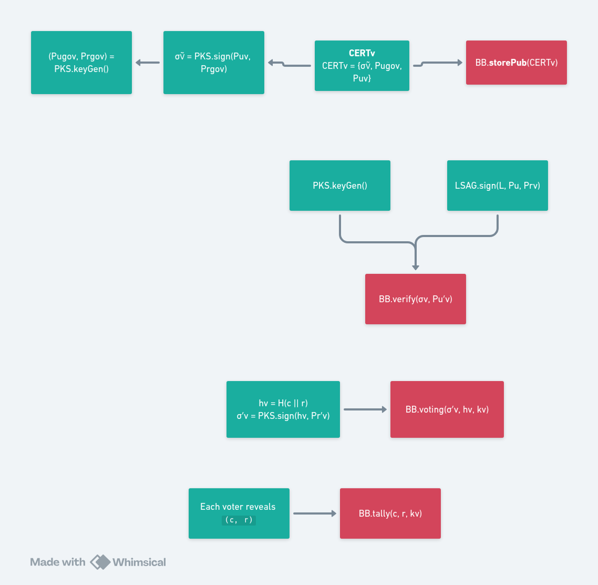

# LSAG-Based E-Voting Smart Contract

This repository contains a simplified Solidity smart contract implementing an LSAG (Linkable Spontaneous Anonymous Group) based electronic voting system with essential on-chain functionality.

**Deployed Contract Address**: `0x4ECFddFb3487b3Cc2C7d85cB6C5075Bf78dF919e`

## Contract Overview

### EVoting.sol
**Purpose**: Core bulletin board functionality for LSAG-based e-voting protocol

**Key Features**:
- Public key storage and verification
- Encrypted vote submission
- Vote tallying with decryption results
- Event-driven transparency
- Gas-optimized storage patterns

**Main Functions**:
- `storePub(signature, publicKey)`: Store voter's public key on bulletin board
- `verify(signature, publicKey)`: Verify stored public key matches provided one
- `voting(signature, hashValue, encryptedVote)`: Submit encrypted vote with hash
- `tally(candidate, randomness, voterKey)`: Record decrypted vote for final tallying

## Architecture Design

### On-Chain Components (Smart Contract)
The `EVoting` contract serves as a **bulletin board** storing:
- Voter public keys with signatures
- Encrypted votes with hash commitments
- Decrypted vote results for tallying
- Verification status and voting records

### Off-Chain Components
All cryptographic operations are handled off-chain for efficiency and flexibility:

#### LSAG Operations
- **Ring signature generation**: Create LSAG signatures using voter rings
- **Signature verification**: Verify LSAG signatures against public key rings
- **Linkability checking**: Detect double-voting through key image comparison
- **Key image extraction**: Extract linkable key images from signatures

#### Cryptographic Functions
- **PKS signature verification**: Verify government certificate signatures
- **Vote encryption/decryption**: Encrypt votes for privacy, decrypt for tallying
- **Hash generation**: Create vote commitments and verification hashes
- **Randomness generation**: Generate cryptographic randomness for protocols

#### Protocol Logic
- **Ring formation**: Create anonymity sets from registered voters
- **Vote validation**: Verify vote format and cryptographic proofs
- **Tallying algorithms**: Aggregate and count decrypted votes
- **Result verification**: Verify final tally against individual votes

